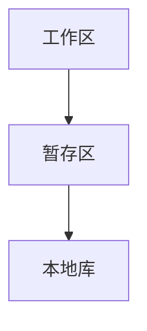

# Git

## 1. 结构



本地库和远程库的关系

1.团队内部

push：将本地库的东西推送到远程库（只有加入团队才可以push）

clone：将远程库的内容克隆到本地

pull：将提交的内容拉去到本地

2.跨团队

fork：将一个远程库复制到另一个远程库

pull request：远程库拉去另一个远程库的更新并合并到本地

merge：合并库

## 2. 初始化本地仓库以及常用命令

`git --version`查看版本

1.设置签名

设置用户名和邮箱

`git config --global user.name "zhouhao"`

` git config --global user.email "1414309848@qq.com"`


2.初始化本地操作

`git init`---->`Initialized empty Git repository in D:/Project/git_learn/.git/`


3.添加文件到**暂存区**

`git add 1.txt/*`


4.将**暂存区**的文件提交到**本地库**

`git commit -m "xxxxxx"`


5.查看工作区和暂存区的文件及其状态

`git status`---->

```git
On branch master
Untracked files:
  (use "git add <file>..." to include in what will be committed)
        README.md

nothing added to commit but untracked files present (use "git add" to track)
```


6.产看提交的日志

`git log`---->

```c++
commit 074ebe4f2027bce15a45d13c1c31c809a65c51f1 (HEAD -> master)//索引
Author: zhouhao <1414309848@qq.com>
Date:   Sun Jan 9 16:30:22 2022 +0800

    2

commit 8fe953ff1f40d39731d262d0cfa8935098b09814
Author: zhouhao <1414309848@qq.com>
Date:   Sun Jan 9 16:09:54 2022 +0800

    新的文件
```

如果提交的记录过多会发生一页不能完整显示的结果！！

`git log --pretty=oneline`每个记录显示为一行

```c++
074ebe4f2027bce15a45d13c1c31c809a65c51f1 (HEAD -> master) 2
8fe953ff1f40d39731d262d0cfa8935098b09814 新的文件
```

`git log --oneline`只截取索引的一部分以及信息在一行内

```c++
074ebe4 (HEAD -> master) 2
8fe953f 新的文件
```

`git reflog`  查看提交以及指针修改的历史命令   多了`HEAD@{num}`回退步骤的数量

```c++
074ebe4 (HEAD -> master) HEAD@{0}: commit: 2
8fe953f HEAD@{1}: commit (initial): 新的文件
```

可以通过

7.前进或者后退历史版本

`git reset --hard xxxxx` ---->`HEAD is now at 074ebe4 2`

```c++
074ebe4 (HEAD -> master) HEAD@{0}: reset: moving to HEAD
074ebe4 (HEAD -> master) HEAD@{1}: commit: 2
8fe953f HEAD@{2}: commit (initial): 新的文件
```

hard参数：本地库的指针移动并且重置暂存区和工作区

mixed参数：重置暂存区，但是工作区不改变

soft参数：工作，暂存区不改变


`git reset --hard HEAD^`回退到上一个版本,`HEAD^^`则回退两个版本，`HEAD~n`回退n个版本

```c++
/d/Project/git_learn> git log --oneline
ba1544f (HEAD -> master) changed
074ebe4 2
8fe953f 新的文件
/d/Project/git_learn> git reset --hard HEAD^
HEAD is now at 074ebe4 2
/d/Project/git_learn> git log --oneline
074ebe4 (HEAD -> master) 2
8fe953f 新的文件

```


8.在工作区删除文件，在暂存区同步

```c++
git status
On branch master
Changes not staged for commit:
  (use "git add/rm <file>..." to update what will be committed)
  (use "git restore <file>..." to discard changes in working directory)
        deleted:    2.txt

Untracked files:
  (use "git add <file>..." to include in what will be committed)
        README.md

no changes added to commit (use "git add" and/or "git commit -a")
```

`git rm/add 2.txt`就可以同步文件  之后进行提交就可以同步本地库中的文件了


9.找回本地库中的文件

方案一：其实就是回退版本`git reset --hard 074ebe4`

方案二：从本地库中选定一个文件恢复 `git checkout -- [文件名]`


10.删除工作区数据，同步到暂存区，之后恢复暂存区的文件

```c++
On branch master
Changes to be committed:
  (use "git restore --staged <file>..." to unstage)
        deleted:    2.txt

Untracked files:
  (use "git add <file>..." to include in what will be committed)
        README.md
```

直接harf回滚


11.diff命令

修改文件导致暂存区和工作区文件不一致

```c++
On branch master
Changes not staged for commit:
  (use "git add <file>..." to update what will be committed)
  (use "git restore <file>..." to discard changes in working directory)
        modified:   2.txt
```

==通过`git diff [文件名]`来比对文件==

```c++
diff --git a/2.txt b/2.txt
index d931c57..6ff8041 100644
--- a/2.txt
+++ b/2.txt
@@ -1,7 +1,8 @@
 asfdasdfasdf萨德sa地方
 阿斯蒂芬
 asdf asdf asd发
-asdf as地方
+123123123124123
 asd发
 阿斯顿
-as
\ No newline at end of file
+as
+s大法师大法师发生的fasd
\ No newline at end of file

```

==`git diff`如果没有文件名则比对所有文件==

`git diff --cached  [<path>...] `**比较暂存区与最新本地版本库**

`git diff HEAD [<path>...]`**比较工作区与最新本地版本库**

## 3. 远程仓库

### 克隆远程仓库到本地

`git clone xxxxxxxxxxxxxxxxxx`

### 设置token

` git config user.password "token"` 

### 配置代理

`git config --global http.proxy 'socks5://127.0.0.1:10808'`

`git config --global https.proxy 'socks5://127.0.0.1:10808'`

### 从本地推送到远程库

`git remote set-url origin https://[token]@github.com/名字/仓库名.git`

`git push -u origin master `


1.查看远程仓库列表 `git remote -v`

```c++
bakkdoor  https://github.com/bakkdoor/grit (fetch)
bakkdoor  https://github.com/bakkdoor/grit (push)
cho45     https://github.com/cho45/grit (fetch)
cho45     https://github.com/cho45/grit (push)
defunkt   https://github.com/defunkt/grit (fetch)
defunkt   https://github.com/defunkt/grit (push)
koke      git://github.com/koke/grit.git (fetch)
koke      git://github.com/koke/grit.git (push)
origin    git@github.com:mojombo/grit.git (fetch)
origin    git@github.com:mojombo/grit.git (push)
```

2.添加远程仓库

`git remote add <shortname> <url>`

这些短名字可以代替整个url

## 分支

| 命令                                 | 描述                                                         |
| ------------------------------------ | ------------------------------------------------------------ |
| git checkout [branch]                | 切换到指定分支                                               |
| git checkout -b [new_branch]         | 新建分支并切换到新建分支                                     |
| git branch -d [branch]               | 删除指定分支                                                 |
| git branch [new_branch]              | 新建分支                                                     |
| git merge [branch]                   | 合并分支（要先切会master分支，然后再master分支上来合并分支） |
| git branch -m  [old_name] [new_name] | 重命名分支                                                   |

### 分支的push和pull

| 命令                                                  | 描述                              |
| ----------------------------------------------------- | --------------------------------- |
| git branch -a                                         | 查看本地和远程分支                |
| git push [origin] [branch]                            | 推送本地分支到远程                |
| git push [origin] :remote_branch                      | 删除远程分支（保留本地分支）      |
| git checkout -b [local_branch] [origin/remote_branch] | 拉去 远程指定分支并在本地创建分支 |
| git fetch <remote>                                    | 从远程仓库同步新的内容            |

### merge冲突

如果两个分支都修改了同一个文件

那么merge之后文件冲突的地方会有

```c++
Auto-merging 6.txt
CONFLICT (content): Merge conflict in 6.txt
Automatic merge failed; fix conflicts and then commit the result.
```

6.txt

```c++
<<<<<<< HEAD
dfsadfasdf sadf asdfastw refadfvsc
=======
sdafasdfasdfasdf sadf asdf
>>>>>>> new
```

根据使劲情况具体分析,修改后重新提交


